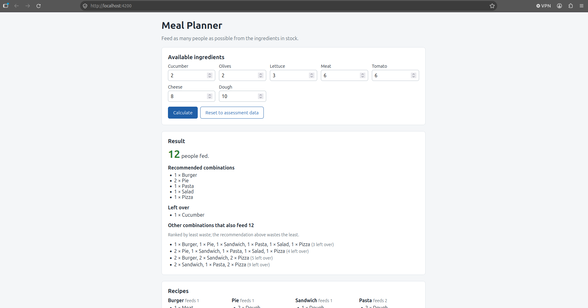

# MetroFibre Assessment: Meal Planner

Given a stock of ingredients and a list of recipes, find the combination of
dishes that feeds the most people.

- **Backend:** vanilla PHP, written to PHP 5.2 syntax and run on PHP 5.5
- **Frontend:** Angular 16

## Answer

**12 people** can be fed. Five combinations achieve this:

| Combination                                            | Left over       |
| ------------------------------------------------------ | --------------- |
| 1 Burger, 2 Pie, 1 Pasta, 1 Salad, 1 Pizza             | 1 (recommended) |
| 1 Burger, 1 Pie, 1 Sandwich, 1 Pasta, 1 Salad, 1 Pizza | 3               |
| 2 Pie, 1 Sandwich, 1 Pasta, 1 Salad, 1 Pizza           | 4               |
| 2 Burger, 2 Sandwich, 2 Pizza                          | 5               |
| 2 Sandwich, 1 Pasta, 2 Pizza                           | 9               |

The recommended combination uses every ingredient except one cucumber.



The full API response is in [docs/output.json](docs/output.json).

## Approach

The solver (`backend/Solver.php`) runs an exhaustive depth-first search: for
each recipe it tries every quantity the remaining stock allows, then recurses
into the next recipe. Every feasible combination is visited, so the result is
guaranteed optimal.

- **Why not greedy?** Always making the dish that feeds the most is not
  guaranteed to be optimal. `backend/tests/SolverTest.php` includes a small
  case where greedy feeds 3 and the true optimum is 4.
- **Why exhaustive is fine here:** stock limits each recipe to a few servings,
  so the assessment data has roughly 1,400 combinations at most. The API caps
  quantities at 20 per ingredient to keep the search bounded.
- **Ties:** the brief asks only to feed as many people as possible, so several
  answers are equally valid. All are returned, ranked by least leftover
  ingredients, then fewest dishes to prepare.

## Project structure

```
backend/
  public/api.php        HTTP endpoint (the only web-accessible file)
  Solver.php            Search algorithm
  data.php              Recipes and stock from the assessment
  tests/                PHP tests and an API smoke test
frontend/               Angular 16 app
docs/                   Output and screenshot
docker-compose.yml      PHP 5.5 + Apache
```

## Running it

Requirements: Docker, and Node 18 (`nvm use` inside `frontend/`).

```bash
# Backend on http://localhost:8080
docker compose up -d

# Frontend on http://localhost:4200
cd frontend
npm install
npm start
```

The Angular dev server proxies `/api.php` to the PHP container, so no CORS
configuration is needed.

If `php:5.5-apache` fails to pull with a "content digest not found" error,
Docker's containerd image store cannot unpack this older image. Setting
`"features": {"containerd-snapshotter": false}` in `/etc/docker/daemon.json`
and restarting Docker resolves it.

## API

| Method          | Body                            | Result                                                                           |
| --------------- | ------------------------------- | -------------------------------------------------------------------------------- |
| `GET /api.php`  | none                            | Solves the assessment data                                                       |
| `POST /api.php` | `{"ingredients": {"Dough": 5}}` | Solves with custom quantities (0 to 20); omitted ingredients keep their defaults |

Invalid input returns `400` with an `error` message.

## Tests

```bash
# Solver tests (run on PHP 5.5 inside the container)
docker compose exec backend php /var/www/app/tests/SolverTest.php

# API smoke test
./backend/tests/api-smoke.sh

# Frontend unit tests
cd frontend && npm test -- --watch=false --browsers=ChromeHeadless
```

## PHP compatibility notes

The backend avoids everything introduced after PHP 5.2: no namespaces,
closures, short array syntax, `__DIR__` or `http_response_code()`.
